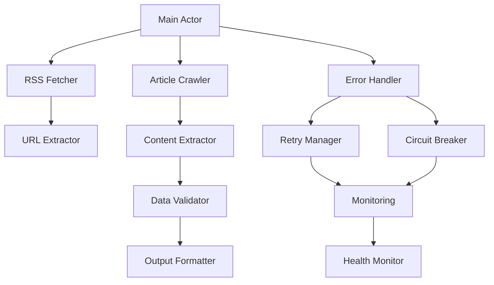

# Developer Guide

This guide provides technical documentation for developers working on or contributing to the Google News Scraper project.

## Table of Contents

- [Architecture Overview](#architecture-overview)
- [Project Structure](#project-structure)
- [Core Components](#core-components)
- [Development Setup](#development-setup)
- [Testing Framework](#testing-framework)
- [Error Handling System](#error-handling-system)
- [Performance Optimization](#performance-optimization)
- [Contributing Guidelines](#contributing-guidelines)

## Architecture Overview

### System Architecture

The Google News Scraper follows a modular, event-driven architecture with the following key principles:

1. **Separation of Concerns**: Each module has a single responsibility
2. **Error Resilience**: Comprehensive error handling and recovery
3. **Performance Optimization**: Memory management and concurrent processing
4. **Extensibility**: Plugin-based architecture for easy extension
5. **Observability**: Built-in monitoring and debugging capabilities

### Data Flow

```
Input Validation → RSS Fetching → URL Extraction → Content Crawling → Data Processing → Output
       ↓              ↓              ↓               ↓                ↓             ↓
   Error Handler → Retry Logic → Circuit Breaker → Monitoring → Storage → Dataset
```

### Component Interaction



## Project Structure

### Directory Layout

```
google-news-scraper/
├── src/                          # Source code
│   ├── main.js                   # Main actor entry point
│   ├── rss-fetcher.js           # RSS feed processing
│   ├── article-crawler.js       # Article content extraction
│   ├── url-extractor.js         # URL processing and validation
│   ├── content-extractor.js     # Content extraction logic
│   ├── error-handler.js         # Error classification and handling
│   ├── error-handling-integration.js # Error system integration
│   ├── circuit-breaker.js       # Circuit breaker implementation
│   ├── retry-manager.js         # Retry logic and backoff
│   ├── monitoring.js            # Performance monitoring
│   ├── health-monitor.js        # System health tracking
│   ├── graceful-degradation.js  # Fallback strategies
│   ├── error-recovery.js        # Recovery mechanisms
│   ├── utils.js                 # Utility functions
│   ├── config.js                # Configuration management
│   ├── dev-config.js            # Development configuration
│   ├── debug-logger.js          # Enhanced logging
│   ├── local-testing-tools.js   # Development testing tools
│   └── local-storage.js         # Local data persistence
├── dev/                          # Development tools
│   ├── setup.js                 # Environment setup
│   ├── test-runner.js           # Development test runner
│   ├── scenario-runner.js       # Test scenario execution
│   ├── health-check.js          # Environment health check
│   ├── cleanup.js               # Development cleanup
│   ├── monitor.js               # Real-time monitoring
│   └── mock-data/               # Mock data for testing
├── tests/                        # Test suites
│   ├── unit/                    # Unit tests
│   ├── integration/             # Integration tests
│   └── performance/             # Performance tests
├── docs/                         # Documentation
├── logs/                         # Log files
├── storage/                      # Local storage
└── cache/                        # Temporary cache
```

### Module Dependencies

```javascript
// Core dependencies
import { Actor } from 'apify';
import { CheerioCrawler, PlaywrightCrawler } from 'crawlee';
import { XMLParser } from 'fast-xml-parser';
import unfluff from 'unfluff';

// Internal modules
import { RssFetcher } from './rss-fetcher.js';
import { ArticleCrawler } from './article-crawler.js';
import { errorHandling } from './error-handling-integration.js';
import { monitoring } from './monitoring.js';
```

## Core Components

### RSS Fetcher (`rss-fetcher.js`)

Handles Google News RSS feed processing with advanced features:

#### Key Features
- **URL Construction**: Builds Google News RSS URLs with parameters
- **XML Parsing**: Parses RSS feeds using fast-xml-parser
- **Deduplication**: Removes duplicate articles using GUID/URL
- **Date Filtering**: Filters articles by publication date
- **Error Handling**: Robust error handling with retries

#### API

```javascript
class RssFetcher {
    constructor(options = {}) {
        this.requestDelay = options.requestDelay || 2000;
        this.maxRetries = options.maxRetries || 3;
        this.timeout = options.timeout || 30000;
    }

    async fetchRssItems(input) {
        // Returns Map of articles with metadata
    }

    buildRssUrl(query, region, language, dateRange) {
        // Constructs Google News RSS URL
    }

    parseRssContent(xmlContent) {
        // Parses XML and extracts articles
    }
}
```

### Article Crawler (`article-crawler.js`)

Handles article content extraction with multiple strategies:

#### Key Features
- **Multi-Strategy Extraction**: Unfluff, CSS selectors, heuristics
- **Browser Fallback**: Automatic fallback to browser mode
- **Content Validation**: Quality scoring and validation
- **Image Processing**: Image extraction and validation
- **Session Management**: Cookie and session handling

#### API

```javascript
class ArticleCrawler {
    constructor(options = {}) {
        this.maxConcurrency = options.maxConcurrency || 10;
        this.requestDelay = options.requestDelay || 2000;
        this.enableBrowserMode = options.enableBrowserMode || false;
    }

    async crawlArticles(articles, input) {
        // Crawls articles and extracts content
    }

    async extractContent(url, html) {
        // Extracts content using multiple strategies
    }

    validateContent(content) {
        // Validates and scores content quality
    }
}
```

### Error Handling System

#### Error Handler (`error-handler.js`)

Classifies and handles different types of errors:

```javascript
class ErrorHandler {
    classifyError(error, context) {
        // Classifies error type and severity
        return {
            type: 'NETWORK|PARSING|RATE_LIMIT|TIMEOUT',
            severity: 'LOW|MEDIUM|HIGH|CRITICAL',
            retryable: boolean,
            category: 'INFRASTRUCTURE|APPLICATION|USER'
        };
    }

    async handleError(error, context) {
        // Handles error based on classification
    }
}
```

#### Circuit Breaker (`circuit-breaker.js`)

Prevents cascade failures:

```javascript
class CircuitBreaker {
    constructor(options) {
        this.failureThreshold = options.failureThreshold || 5;
        this.recoveryTimeout = options.recoveryTimeout || 60000;
        this.state = 'CLOSED'; // CLOSED, OPEN, HALF_OPEN
    }

    async execute(operation, context) {
        // Executes operation with circuit breaker protection
    }
}
```

#### Retry Manager (`retry-manager.js`)

Implements intelligent retry logic:

```javascript
class RetryManager {
    async executeWithRetry(operation, options) {
        // Executes operation with exponential backoff
        const backoffDelay = Math.min(
            options.baseDelay * Math.pow(2, attempt),
            options.maxDelay
        );
    }
}
```

### Monitoring System

#### Performance Monitoring (`monitoring.js`)

Tracks system performance and health:

```javascript
class PerformanceMonitor {
    collectMetrics() {
        return {
            memory: process.memoryUsage(),
            cpu: process.cpuUsage(),
            requests: this.requestStats,
            errors: this.errorStats
        };
    }

    trackRequest(url, duration, success) {
        // Tracks request performance
    }

    generateReport() {
        // Generates performance report
    }
}
```

## Development Setup

### Prerequisites

- Node.js 18+ 
- npm or yarn
- Git

### Installation

```bash
# Clone repository
git clone https://github.com/your-username/google-news-scraper
cd google-news-scraper

# Install dependencies
npm install

# Set up development environment
npm run dev:setup

# Copy environment configuration
cp .env.example .env
```

### Development Commands

```bash
# Development mode with hot reload
npm run dev:watch

# Run with debugger
npm run dev:debug

# Run development tests
npm run dev:test

# Run test scenarios
npm run dev:scenarios

# Health check
npm run dev:health

# Real-time monitoring
npm run monitor

# Clean development data
npm run dev:clean
```

## Testing Framework

### Test Structure

```
tests/
├── unit/                    # Unit tests for individual modules
│   ├── rss-fetcher.test.js
│   ├── article-crawler.test.js
│   └── error-handler.test.js
├── integration/             # Integration tests
│   ├── full-workflow.test.js
│   └── error-scenarios.test.js
└── performance/             # Performance tests
    ├── memory-usage.test.js
    └── concurrency.test.js
```

### Writing Tests

#### Unit Test Example

```javascript
import { RssFetcher } from '../src/rss-fetcher.js';
import { jest } from '@jest/globals';

describe('RssFetcher', () => {
    let rssFetcher;

    beforeEach(() => {
        rssFetcher = new RssFetcher();
    });

    test('should build RSS URL correctly', () => {
        const url = rssFetcher.buildRssUrl('test', 'US', 'en-US', 'week');
        expect(url).toContain('news.google.com/rss/search');
        expect(url).toContain('q=test');
        expect(url).toContain('gl=US');
    });

    test('should handle network errors gracefully', async () => {
        // Mock network error
        jest.spyOn(global, 'fetch').mockRejectedValue(new Error('Network error'));
        
        await expect(rssFetcher.fetchRssItems({ query: 'test' }))
            .rejects.toThrow('Network error');
    });
});
```

#### Integration Test Example

```javascript
import { Actor } from 'apify';
import { main } from '../src/main.js';

describe('Full Workflow Integration', () => {
    beforeAll(async () => {
        await Actor.init();
    });

    afterAll(async () => {
        await Actor.exit();
    });

    test('should complete full scraping workflow', async () => {
        const input = {
            query: 'test query',
            maxItems: 5,
            region: 'US'
        };

        await main();
        
        const dataset = await Actor.openDataset();
        const { items } = await dataset.getData();
        
        expect(items.length).toBeGreaterThan(0);
        expect(items[0]).toHaveProperty('title');
        expect(items[0]).toHaveProperty('url');
    });
});
```

### Mock Data System

The development environment includes a comprehensive mock data system:

```javascript
// Create mock RSS feed
localTestingTools.createMockRssFeed('test_query', [
    {
        title: 'Test Article',
        link: 'https://example.com/test',
        guid: 'test-123',
        pubDate: new Date().toUTCString(),
        description: 'Test description',
        source: 'Test Source'
    }
]);

// Create mock article HTML
localTestingTools.createMockArticle('test_article', {
    title: 'Test Article',
    content: 'Test content',
    author: 'Test Author'
});
```

## Error Handling System

### Error Classification

Errors are automatically classified into categories:

1. **Network Errors**: Connection issues, timeouts, DNS failures
2. **Parsing Errors**: Invalid XML, malformed HTML, encoding issues
3. **Rate Limit Errors**: Too many requests, quota exceeded
4. **Content Errors**: Missing content, extraction failures
5. **System Errors**: Memory issues, disk space, permissions

### Recovery Strategies

1. **Immediate Retry**: For transient network errors
2. **Exponential Backoff**: For rate limiting and server errors
3. **Circuit Breaker**: For persistent failures
4. **Graceful Degradation**: Return partial results
5. **Alternative Methods**: Fallback extraction strategies

### Error Monitoring

```javascript
// Error tracking
errorHandling.onError((error, context) => {
    console.log(`Error: ${error.type} in ${context.operation}`);
    
    // Send to monitoring system
    monitoring.trackError(error, context);
});

// Health monitoring
healthMonitor.onHealthChange((status) => {
    if (status.overall.score < 70) {
        console.warn('System health degraded');
    }
});
```

## Performance Optimization

### Memory Management

1. **Streaming Processing**: Process articles in batches
2. **Garbage Collection**: Explicit cleanup of large objects
3. **Memory Monitoring**: Track memory usage and limits
4. **Cache Management**: LRU cache with size limits

### Concurrency Control

1. **Request Limiting**: Maximum concurrent requests
2. **Rate Limiting**: Delays between requests
3. **Resource Pooling**: Reuse browser instances
4. **Queue Management**: Priority-based request queuing

### Optimization Techniques

```javascript
// Memory-efficient processing
async function processArticlesBatch(articles, batchSize = 50) {
    for (let i = 0; i < articles.length; i += batchSize) {
        const batch = articles.slice(i, i + batchSize);
        await processBatch(batch);
        
        // Force garbage collection
        if (global.gc) {
            global.gc();
        }
    }
}

// Connection pooling
const crawler = new CheerioCrawler({
    maxConcurrency: 10,
    maxRequestRetries: 3,
    requestHandlerTimeoutSecs: 30,
    
    // Reuse connections
    persistCookiesPerSession: true,
    sessionPoolOptions: {
        maxPoolSize: 50,
        sessionOptions: {
            maxUsageCount: 100
        }
    }
});
```

## Contributing Guidelines

### Code Style

1. **ESLint Configuration**: Follow project ESLint rules
2. **Prettier Formatting**: Use Prettier for code formatting
3. **JSDoc Comments**: Document all public methods
4. **Error Handling**: Always handle errors gracefully
5. **Testing**: Write tests for new features

### Pull Request Process

1. **Fork Repository**: Create a fork of the main repository
2. **Feature Branch**: Create a branch for your feature
3. **Write Tests**: Add comprehensive tests
4. **Documentation**: Update relevant documentation
5. **Code Review**: Submit PR for review

### Development Workflow

```bash
# Create feature branch
git checkout -b feature/new-feature

# Make changes and test
npm run dev:test
npm run test
npm run lint

# Commit changes
git commit -m "feat: add new feature"

# Push and create PR
git push origin feature/new-feature
```

### Code Review Checklist

- [ ] Code follows style guidelines
- [ ] Tests are comprehensive and passing
- [ ] Documentation is updated
- [ ] Error handling is implemented
- [ ] Performance impact is considered
- [ ] Security implications are reviewed

For more detailed information, see the [Contributing Guide](../CONTRIBUTING.md).
